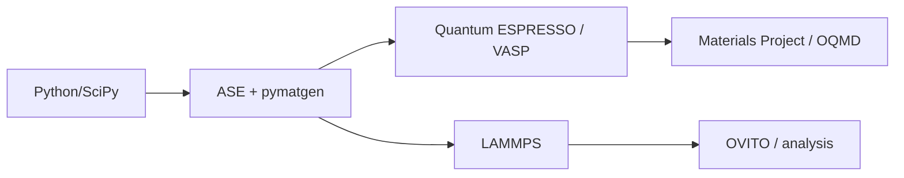

# 🗺️ Postgraduate Materials Science Roadmap

> The arc: **characterization → computation → battery / energy R&D** — aligned with PhD and R&D job targets.

## Suggested map (2-year M.Sc./M.Tech.)

| Semester | Core focus | Skills |
|---|---|---|
| Sem 1 | Thermodynamics of Materials, Solid State | Python basics |
| Sem 2 | Characterization (XRD/SEM/TEM/DSC/AFM) | Lab + data analysis |
| Sem 3 | Specialization (thin films / polymers / battery) | DFT (QE) + MD (LAMMPS) |
| Sem 4 | Dissertation / project | pymatgen, Materials Project |

## Computational on-ramp

See [computational-dft-md.md](courses/computational-dft-md.md).
